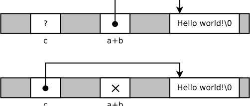

# Passing resources between objects: rvalue references

Consider the following examples:

```c++
void func(String s);

String a = ..., b = ...;
func(a + b);  // 1

String c = ...;
c = a + b;    // 2
```

1. The function `func` expects a `String` argument. If we cannot juggle with temporary objects so that the return value of `a+b` is at the correct location, a copy of the temporary is to be created. However, this copy (an array allocated with `new char[]` and filled with data) is unnecessary, and slows down execution.
2. Here the assignment operator will get the temporary object, and copy its array. However, the temporary will be destroyed, and its array could have been used (stolen).

It would be nice to pass the array around instead of making unnecessary copies. But how can we tell whether we can steal the array or we must make a copy?

Here the concatenated string is a temporary, its array could be passed to `c`:

```c++
String a = "apple", b = "tree", c;
c = a + b;          // the concatenated string is a temporary, we could use its array
```

The next example also has an assignment. However, it must copy the array in `b`, it cannot steal it, as `b` is used later in the code:

```c++
String a = "apple", b = "banana";
a = b;
std::cout << b;     // b is copied, as they should be independent
```

So we'd like to have the following overloads:

```c++
class String {
  public:
    String& operator=(TEMPORARY_OBJECT String) {
        /* steal array... */
    }
    String& operator=(NAMED_OBJECT String) {
        /* copy array... */
    }
};
```

Modern C++ can make this distinction. The reference `&&` is an rvalue-reference, and it can only be bound to a temporary object. Overload resolution also takes this into consideration:

```c++
void func(String const & s) {   // lvalue reference (variable)
    std::cout << "lvalue";
}

void func(String && s) {        // rvalue reference (temporary object)
    std::cout << "rvalue";
}

String a, b;
func(a);      // this is a variable, the first function is called
func(a + b);  // this is a temporary object, the second function is called
```

Remarks:

1. Usually we pronounce `&&` as "ref-ref", ie. "func takes an argument of type String ref-ref".
2. The names lvalue and rvalue are somewhat anachronistic, and come from the C language, where lvalues must stand on the left hand side of an assignment operator, and rvalues can only be on the right hand side. This is not true in C++, eg. constants can be lvalues, but cannot be assigned to. In C++, we usually call temporary (unnamed) objects rvalues ("r-values"), and everything else, like variables, dereferenced pointers etc. lvalues ("l-values").

## Move constructors and assignment operators

Our previous string class with the new operations:

```c++
#include <iostream>
#include <stdexcept>
#include <cstring>

class String {
  private:
    char *data;
    size_t len;

  public:
    String(char const *init);
    ~String();
    String(String const &s);
    // new overload for constructors
    String(String &&s);
    String & operator=(String const &s);
    // new overload for assignment
    String & operator=(String &&s);
};

// the usual constructor
String::String(char const *init) {
    len = strlen(init);
    data = new char[len+1];
    strcpy(data, init);
}

// each string has its own array, so it is deleted
// when the string is destroyed
String::~String() {
    delete[] data;
}

// when a new string is to be created, and the 'specimen' is an lvalue,
// its contents must be copied
String::String(String const &s) {
    len = s.len;
    data = new char[len+1];
    strcpy(data, s.data);
}

// however when an rvalue is the specimen, we can actually steal its array:
// 1) our pointer will store the address of its array
// 2) its ptr is nulled, so its destructor will be a no-op
// the length is just copied.
// this is the move ctor.
String::String(String && s) noexcept {
    len = s.len;
    data = s.data;  // !
    s.data = nullptr;
}

// assignment from an lvalue: must copy.
String & String::operator=(String const &s) {
    if (this != &s) {
        delete[] data;
        len = s.len;
        data = new char[len+1];
        strcpy(data, s.data);
    }
    return *this;
}

// assignment from an rvalue (temporary): like the move ctor.
// old data is to be destroyed, and the array is stolen from s.
// this is called the move assignment operator.
String & String::operator=(String && s) noexcept {
    if (this != &s) {
        delete[] data;
        len = s.len;
        data = s.data;
        s.data = nullptr;
    }
    return *this;
}
```

Important things to note:

- Rvalue references are mostly non-const. One can only take advantage of the temporary objects if they can be modified, ie. the resource can be moved from it. For this to work, it must be modifiable.
- The destructor of the temporary object will rune later. An important thing to achieve is that the destructor does nothing. This is why `s.data = nullptr` is important in the above examples. The exact contents of the moved-from object is not really important (unspecified).
- The moved-from (emptied) object can later be assignet a new value (see below). This is why we say that the moved-from objects is to be left in a "destructable and assignable" state.
- In the move assignment operator, checking self-assignment is important. Rvalues are not necessarily temporaries, but one can also cast a variable to an rvalue – see below.
- Move constructors and assignments are usually `noexcept` functions, as there is no resource allocation. By stating this fact in the function header, we enable some optimizations.

The name "move constructor" must not be misunderstood. Technically, nothing moves: a new object is created, and some pointers are modified. This is a constructor, which creates a new object, and the old one will also stay in the memory for some time. The resource is handed over from one object to the other, that is why we say it is "moved".The figure below shows the memory map before and after the move:

```c++
String c = a+b;
```



The first part is when the move constructor is invoked. At this time, the object `c` is not yet initialized, it stores garbage. `a+b` is initialized, and it stores the pointer to the array. After running constructor the pointer of the String `c` will point to this array, and the pointer of `a+b` becomes `nullptr`. Nothing has moved, actually. But now the array is handled by `c`, and `a+b` has no array.


## Explicit rvalue casts

The swap function exchanges values of two variables:

```c++
template <typename T>
void old_swap(T & a, T & b) { // C++98 swap
    T temp = a;
    a = b;
    b = temp;
}
```

This is quite inefficient, as three copies are made. Although the arguments are not rvalues (we exchange values of two *variables*), but still we want to *move* their contents around, and not copy them. This is possible using `std::move`:

```c++
template <typename T>
void new_swap(T & a, T & b) { // C++11 swap
    T temp = std::move(a);
    a = std::move(b);
    b = std::move(temp);
}
```

The first code line moves the contents from `a` to `temp`. The second line "revives" the empty object `a`, by giving it a new value. This value is moved from `b`, so now `b` is empty, it is in a moved-from state. The third line "revies" `b` by moving the value from `temp`. So `temp` is now empty, and when its destructor runs, nothing will happen.

The function `std::move` is not a magical thing: it is equivalent to `static_cast<T &&>(a)`, ie. a cast from lvalue to rvalue. But we use `move` to express intent; it's easier to read.

Typical usage is:

```c++
class Customer {
  private:
    std::string name;
    int age;
    
  public:
    Customer(std::string name, int age)
        : name(std::move(name)), age(age)
    {
    }
};
```

When a `Customer` object is created, a string object is created as well, to store the name. This means that it is impossible to create a `Customer` without creating the string. So the argument of the constructor should be a *value*, and the contents of the argument string is later moved to the attribute string.

We call this idiom a *sink argument*. It leads to efficient code, because the string argument can be initialized by copying, by moving or by optimizing a temporary object.

## A few words about std::unique_ptr

```c++
template <typename T>
class unique_ptr {
  private:
    T *p;

  public:
    explicit unique_ptr(T *p) : p(p) {}

    unique_ptr(unique_ptr const &) = delete;
    unique_ptr(unique_ptr && u) {
        p = u.p;
        u.p = nullptr;
    }
    unique_ptr & operator=(unique_ptr const &) = delete;
    unique_ptr & operator=(unique_ptr && u) {
        /* ... */
    }
};
```

This is how the unique pointer is implemented: one can pass the managed object around (move constructor), but cannot have two pointers to the same object (copy constructor). The copy constructor and the copy assignment operator is deleted; whenever it would be the choice after overload resolution, a compile error is generated.

And this is why we have to use `std::move` when passing the managed object around. See the expression example:

```c++
class TwoOp: public Expression {
  public:
    /* ... */
    TwoOp(std::unique_ptr<Expression> left, std::unique_ptr<Expression> right)
        : left(std::move(left)), right(std::move(right)) {}
    /* ... */
};
```

File objects and other classes representing resources are similar. They are movable (move constructible) but not copiable.


## Other considerations

### An rvalue reference is not an rvalue

In this function, the move constructor is *not* called, but the string will be copied instead:

```c++
void func(String && s) {
    String s2(s);
}
```

This has a subtle but rather important reason. Although the reference `s` is bound to a temporary object, it has given it a name: inside the function, the object can be reached through the name `s`. And this makes it possible to reach the object many times, for example:

```c++
void func(String && s) {
    String s2(s);
    std::cout << s;     // the object is used again
}
```

The rule is simple: things with a name are *not* treated as rvalues. If we know that we want to do so, `std::move` can do that, but then we are explicit about it, and the compiler will accept.

### Do not use std::move when returning a local variable

When returning a from a function, all local variables are treated as temporaries. This means that the `move` in the function is unnecessary:

```c++
String foo() {
    String s;
    ...
    return std::move(s);  // worse
}
```

It's ever worse, as it will disable the return value optimization. Just return the variable, as you always did:

```c++
String foo() {
    String s;
    ...
    return s;  // this is correct & efficient
}
```

### Implicit move

The compiler can generate a move constructor automatically (as it always did for the copy ctor). The rule is simple: in a trivial move ctor, all attributes are moved. But auto-generation if disabled, if any of the resource management functions (dtor, copy ctor) are implemented by the programmer. If we need it, and we know that the auto-generated implementation would be correct, we can state this using `= default`:

```c++
class MyClass {
  public:
    ~MyClass() { /* ... */ }        // this would disable auto-generation of a move ctor
    MyClass(MyClass &&) = default;  // but we ask the compiler to do so
};
```

However, the best way to write code is to use STL containers, and to refactor all resource management to separate classes. This way we can avoid implementing destructors by hand.
