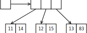

# Advanced memory management


## Puzzle

We get integer numbers from the input. We must maintain an ordered series of these numbers. For example, with the input 5, 4, 1, 2, the container should store:

```
5           // 5 inserted
4 5         // 4 inserted
1 4 5       // ...
1 2 4 5     // always ordered
```

Then we get indices, which show which numbers to delete, eg. for indices 1, 2, 0, 0:

```
1 2 4 5     // [1] to be deleted
1 4 5       // [2] to be deleted
1 5         // [0] to be deleted
5           // [0] to be deleted
            // container is empty
```

The question is: above what size is a linked list better than a vector?


## Solution

The answer is: never. With large element count, the linked list may even be 50-100× slower. Reasons behind this are:

- The algorithm: in the vector we can do binary search.
- Insertion is still problematic, because the elements have to be shifted, for insertion and for erasing as well.
- However, the vector is faster, as the data structure is *local* and *compact*. The list requires two extra pointers per element, this increases the required memory bandwidth and decreases cache efficiency.
- Also remember that although the vector is called a random access container, and the list a sequential read container, the memory layout is exactly the opposite. The vector stores the elements next to each other (contiguous block of memory), and the elements of the list have random positions in memory. This is why `operator*` is sometimes nicknamed "the cache miss operator".

Think about other OOP languages as well like Java, C# or PHP where each object is to be allocated separately, resulting in a scattered, messy layout:

```csharp
Point[] points = new Point[] {
    new Point(11, 14),
    new Point(12, 25),
    new Point(13, 83)
};
```



and in C++:

```c++
std::vector<Point> points = {
    Point(11, 14),
    Point(12, 25),
    Point(13, 83)
};
```


IN C++ more compact memory layouts can be built, and we are in full control of the layout even for our own, "user-defined" types.

The main takeaway is that we should *always* think about vector first, and we will use it most of the time. Other containers are the specialized case.


## std::vector internals – motivation

A naive vector implementation:

```c++
template <typename T>
class Vector {
  private:
    T *data;
    size_t size;
  public:
    void push_back(T obj) {
        T *newdata = new T[size + 1];       // reallocate
        for (size_t i = 0; i < size; ++i)
            newdata[i] = data[i];           // copy (std::move could be used)
        newdata[size] = obj;
        delete[] data;
        data = newdata;
        size += 1;
    }
};
```

This will resize the container for each *push_back*, which results in O(n) resizes, therefore O(n^2) complexity.

Our goal is:

```c++
Vector<Point> points;

points.reserve(200);            // pre-allocate memory
                                // but do not yet call the ctors!
std::cout << points.size();     // 0, as it is still empty
points.push_back(Point(1, 2));  // resize container, without moving data
points.push_back(Point(3, 4));  // ...
// ...
```

The standard `std::vector` is capable of working like this. The `push_back` function will only resize the container, if it is full; also it will always double the size. So it is efficient even if storage is not preallocated with `reserve()`.

Inside the vector we have:


- `data` is the pointer to the storage space.
- `capacity` is the size of storage.
- `size` has the number of "living" elements; beyond size there is only garbage, uninitializeed memory. Obviously `size <= capacity` applies.


## Memory management and lifetime management

For this to work, we must be able to do memory management and object lifetime management independently.


### Memory management: the operator new(size_t) function

C++ has a function very similar to `malloc()`. Each call allocated a new chunk of memory from the free store (heap). The return value is `void*`, and it points to raw, uninitialized memory.

```c++
void * operator new(size_t);
void operator delete(void *) noexcept;
```

This function will throw `std::bad_alloc` if an error is encountered. As classes can have their own overloads for this function, we usually explicitly qualify this function with `::` to get the "global" operator new:

```c++
void * memory = ::operator new(sizeof(int) * 45); /* int[45] */
int * my_ints = static_cast<int *>(memory);
 
my_ints[19] = 75;
 
::operator delete(memory);
```

This function does only allocation, but not initialization.


### Initializing objects: placement new

The `new` operator has a "version" which does not allocate memory, but only calls the constructor of the objects. This is called a placement new, and this format has an extra argument, a `void*` pointer in parentheses after the `new` keyword. The pointer will tell where the object is to be placed; before the call, the memory should already be available, but no object should reside there:

```c++
void *mem = allocate_some_memory(sizeof(MyClass));
MyClass *obj_ptr = new (mem) MyClass(1, 2);
```

The placement new is in the second codeline. This gets the `void*` pointer `mem`, and calls the constructor `MyClass(1, 2)`. Inside the ctor, `this` equals to the address given, ie. `mem`. The value of the whole expression is the address of type `MyClass *`, and no conversion is required here: obviously, because after the call, there is a living `MyClass` object at that location, and not just garbage, uninitialized memory.

This strange syntax is needed as constructors cannot be called with the usual member function invocation syntax. This is not the case for the destructors, where the usual syntax works. As placement new created an object, the destructor must be called:

```c++
obj_ptr->~MyClass();
free_the_block_of_memory(mem);
```

The first line calls the dtor. The syntax `->~` is somewhat strange, but `->` is the usual member access operator, and the name of the method called is `~MyClass()`. This might be a virtual destructor as well.

### Object lifetime

An overview of the ideas presented:


The most important thing here is that mixing the memory allocation mechanisms is never allowed. If the object is allocated
and initialized with `p = new T`, then it must be destroyed with `delete p`. If `malloc` and placement new was used,
destroying must be `->~' dtor and `free`. Even `new / new[]` and `delete / delete[]` must be used in pairs.


## std::vector implementation

```c++
#include <iostream>
#include <algorithm>

template <typename T>
class Vector {
  private:
    T *data;
    size_t size;
    size_t capacity;

  public:
    // ctor: for the sake of demonstration,
    // allocate 2x the memory needed
    Vector(size_t initialsize = 0) {
        size = initialsize;
        capacity = initialsize*2;
        // void* -> T* cast, as we'll place T objects there
        data = (T*) ::operator new(sizeof(T) * capacity);
        // run the default ctors, but only up to size, not capacity
        for (size_t i = 0; i < size; ++i)
            new (&data[i]) T();
    }

    // dtor: we are responsible for calling the dtors.
    // remember there are only 'size' objects, not 'capacity'!
    ~Vector() {
        for (size_t i = 0; i < size; ++i)
            data[i].~T();
        ::operator delete(data);
    }

    // we should implement these as well
    Vector(Vector const &);
    Vector(Vector &&) noexcept;
    Vector & operator=(Vector const &);
    Vector & operator=(Vector &&);

    // reserve will allocate more memory,
    // and move the objects to the new location
    void reserve(size_t newcapacity) {
        if (capacity == newcapacity || newcapacity < size)
            return;

        T *newdata = (T*) operator new(sizeof(T) * newcapacity);
        // std::move is needed, as an indexed array element is an lvalue
        for (size_t i = 0; i < size; ++i) {
            new (&newdata[i]) T(std::move(data[i]));
            data[i].~T();
        }

        ::operator delete(data);
        data = newdata;
        capacity = newcapacity;
    }

    // append new element. increment the size of the vector if needed
    void push_back(T obj) {
        if (size == capacity)
            reserve(std::min(size * 2, (size_t) 1));
            
        new (&data[size]) T(std::move(obj));
        size++;
    }

    // std::vector also has this
    void shrink_to_fit() {
        if (capacity > size)
            reserve(size);
    }

    // other important functions of the vector interface
    T & operator[] (size_t idx);
    T const & operator[] (size_t idx) const;
    // ...
};
```


## Other uses

### Placement new overloads

The `new` function can be overloaded with new arguments. This is how `std::nothrow` works:

```c++
void * operator new(size_t s, std::nothrow_t dummy) noexcept {
    return malloc(s);       // may be nullptr
}

// this calls ::operator new(sizeof(MyClass), std::nothrow);
// then the constructor is called
MyClass *obj = new (std::nothrow) MyClass();
```

The constructor-only version also works like this:

```c++
void * operator new(size_t s, void *p) {
    return p;
}

alignas(T) std::byte memory[sizeof(MyClass)];
// this calls ::operator new(sizeof(MyClass), (void*) memory);
// the function above does no allocation, therefore the effect
// of this line is only the ctor call
MyClass *obj = new (memory) MyClass();
```

Classes can have their own memory management: we can define `operator new` and `operator delete` inside a class. These will still have the `size_t s` argument, as derived classes will inherit the function, so the size can change.

```c++
class MyClass {
  public:
    static void * operator new(size_t s);
    static void operator delete(void *p) noexcept;
};
```

Allocators are objects which can manage storage space. These have standardized methods named `allocate`, `deallocate`,
`construct` and `destroy`. The built-in class `std::allocator` works like this:

```c++
using string = std::string;

std::allocator<string> a;
string *mem = a.allocate(1);
a.construct(mem, "apple");  // string("apple")
std::cout << *mem;          // apple
a.destroy(mem);             // ~string()
a.deallocate(mem, 1);
```

Finally, the `std::vector` class has a little-known second template argument, the allocator. So we could build a vector using our own memory management if we wanted.

```c++
std::vector<std::string, std::allocator<std::string>> v;
```

## std::optional

Often we want to have a container (possibly empty) for one object. In other words, an optional object, which might exist or not. For example, function may return an object, or not. For this task we could use a pointer (as it can be `nullptr`), however this is usually infeasible, as the indirection has its own lifetime and allocation management problems.

We can use `std::optional` instead, which stores an object by value, without indirection. Or it can be empty.

```c++
std::optional<std::string> get_string() {
    std::cout << "Please enter a word: ";
    std::string s;
    if (std::cin >> s)
        return s;       // optional(s)
    else
        return {};      // optional() - empty
}

int main() {
    auto o = get_string();
    if (o)
        std::cout << "The word is: " << *o << std::endl;
    else
        std::cout << "Nothing was entered." << std::endl;
    std::cout << "The content is: " << o.value_or("(empty)") << std::endl;
}
```

Implementation is based on placement new, similar to this code:

```c++
template <typename T>
class Optional {
  private:
    /* to hold the object, consider size and proper alignment */
    alignas(T) std::byte mem[sizeof(T)];
    bool initialized = false;

  public:
    Optional() {}
    Optional(T obj) {
        new (mem) T(std::move(obj));
        initialized = true;
    }

    /* also implement copy ctor, assignment etc. */
    ~Optional() {
        if (initialized)
            reinterpret_cast<T*>(mem)->~T();
    }

    T& operator* () {
        return *reinterpret_cast<T*>(mem);
    }
    T const & operator* () const;  // same as above
    /* value() checks whether the object exists.
     * if you are sure it does, just call operator*, it is faster */
    T& value() {
        if (!initialized)
            throw std::bad_optional_access();
        return *reinterpret_cast<T*>(mem);
    }
    T const & value() const;  // same as above
};


int main() {
    Optional<std::string> s("apple");
    std::cout << *s;
}
```


## std::variant

Similar to `std::optional`, but the type of the stored object can change. The set of types is closed, you must enumerate the types as template arguments.

For this one, the object will *always* exist, there is no empty state. If an empty state is required, use `std::monostate`.

```c++
std::variant<int, double> v;

std::cout << std::get<int>(v);      // 0
v = 12;                             
std::cout << std::get<int>(v);      // 12

try {
    std::cout << std::get<double>(v);
} catch (std::bad_variant_access &e) {
    // currently it is not a double
}

v = 3.14;                           // transforms into a double
std::cout << std::get<double>(v);   // 3.14

// this can be empty
std::variant<std::monostate, int, double> v2;
```


## std::any

This can store anything; there is no list of types as template arguments, the set of types is open:

```c++
int main() {
    std::any a;
    a = 123;
    std::cout << std::any_cast<int>(a);
    try {
        std::cout << std::any_cast<double>(a);
    } catch (std::bad_any_cast & e) {
    }
}
```

This must use dynamic memory management internally, as it cannot guess the maximum size of the object to be stored. It is a little bit slower than a `variant`.

An important term / C++ idiom here is *type erasure*. In C++ this is usually implemented by a container base class. Implementation is similar to this:

```c++
#include <iostream>
#include <string>
#include <utility>


class Any {
  private:
    // So we have a common base class for containers
    class ContainerBase {
      public:
        virtual ~ContainerBase() = default;
        virtual ContainerBase *clone() const = 0;
    };

    // The derivative can store the object by value
    template <typename T>
    class Container : public ContainerBase {
      public:
        T data;
        Container(T what) : data(std::move(what)) {}
        ContainerBase *clone() const { return new Container<T>(*this); }
    };

    // Here we will have one Container<Something>
    ContainerBase *pdata = nullptr;

  public:
    Any() = default;
    Any(Any const &to_copy) {
        pdata = to_copy.pdata->clone();
    }
    Any& operator=(Any const& to_copy) {
        ContainerBase* copy = to_copy.pdata ? to_copy.pdata->clone() : nullptr;
        delete pdata;
        pdata = copy;
        return *this;
    }
    ~Any() { delete pdata; }
    
    template <typename T>
    void set(T what) {
        ContainerBase *newpdata = new Container<T>(std::move(what));
        delete pdata;
        pdata = newpdata;
    }
    
    template <typename T>
    T & get() {
        return dynamic_cast<Container<T>&>(*pdata).data;
    }
    template <typename T>
    T const & get() const {
        return dynamic_cast<Container<T>&>(*pdata).data;
    }
    
};


int main() {
    Any a;
    
    a.set(5);
    std::cout << a.get<int>() << std::endl;
    
    a.set(std::string("hello"));
    std::cout << a.get<std::string>() << std::endl;
}
```
