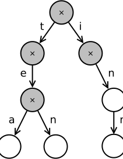
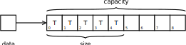
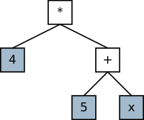

# Exercises

These coding exercises focus on C++ language features.

## Trie tree

Implement a trie tree (radix tree) with STL containers!
Make sure you don't do any manual memory management.

The trie tree is a data structure that stores strings,
and makes lookup based on the prefix very efficient.
The tree below contains the words tea, ten, in and inn.

Create a simple user interface for your program as well.

```
> add tea
added tea.
> add ten
added ten.
> find tea
tea in dict.
> find te
te not in dict.
```



## Smart float

Implement a smart `Float` type, which uses some small
'epsilon' value for all comparisons. Eg. this code
should print true:

```c++
Float f1 = 1.0f, f2 = 1.00001f;
std::cout << (f1 == f2);
```

Implement the arithmetic operators! Implement all comparison
operators: less, equals, greater, greater-or-equal etc. These
should always give consistent answers.

## Stack

Implement a stack using an array! Use `::operator new`
and `::operator delete` for memory management, and use
placement new and explicit destructor calls to create
and destroy objects!

Your stack should have a memory layout very similar to
that of `std::vector`. Use `std::move` whenever applicable.




## Basic function

The class hierarchies block had a `TwoOperand` class for
sums, products etc. Create a base class for all the
basic functions `sin`, `cos` etc. This could be named
a `Function` or a `OneOperand`. Also create two subtypes,
`Sine` and `Cosine`. Implement their evaluation, printing
and differentiation operations.

Be sure to use the chain rule `f(g(x))'=f'(g(x))·g'(x)` for
differentiation. This applies to every `OneOperand`, so
differentiation should be a `final` function in the
`OneOperand` class.

## Build a function I.

With RPN (Reverse Polish Notation) operators are written after
operands. `2 3 +` means `2 + 3`, and `2 3 + x *` means
`(2 + 3) * x`. An expression like this is easy to evaluate using
a stack. For every variable or constant, you push its value to
the stack. For every operation, you pop two values, calculate
the new value, and push it back to the stack. At the end of the
evaluation, there should be one number in the stack, and that is
the value of the evaluated expression.

Use a stack two build the abstract syntax tree! For the input
`4 5 x + *`, your code should build the tree below.



## Build a function II.

Process an RPN expression, and create a `std::function<double(double)>`
from it. The interface should be like:

```c++
// f = 21.7 + 34.2*x
auto f = create_func_from_rpn("21.7 34.2 x * +");     
 
std::cout << f(3) << std::endl;
std::cout << f(4) << std::endl;
std::cout << f(5) << std::endl;
```

Make sure you only parse the argument string *once*. The parsing
should be done in the `create_func_from_rpn()` function, and not
when the created function is called.

Hint 1: Use `std::istringstream` to split the expression by
the spaces, and to parse numbers.

Hint 2: Use a stack and lambda expressions.


## Merge sort

The code below implements merge sorting for integers.

```c++
void merge(int *in, int begin, int mid, int end, int *out) {
    int i = begin, j = mid;
    for (int c = begin; c < end; ++c) {
        if (i < mid && (j >= end || in[i] <= in[j])) {
            out[c] = in[i];
            i++;
        } else {
            out[c] = in[j];
            j++;
        }
    }
}
 
void copy(int *in, int begin, int end, int *out) {
    for (int c = begin; c < end; ++c) {
        out[c] = in[c];
    }
}
 
void merge_sort(int *tomb, int begin, int end, int *temp) {
    if (end - begin < 2)
        return;
    int mid = (begin + end) / 2;
    merge_sort(tomb, begin, mid, temp);
    merge_sort(tomb, mid, end, temp);
    merge(tomb, begin, mid, end, temp);
    copy(temp, begin, end, tomb);
}
```

Make the following changes!

- Make the code templated.
- Write a wrapper function, so that the caller does not have to
provide the temporary working area. This wrapper function can
also have a nicer interface, like `merge(array, size)`.
- Check the code and find all the places where a copy of an object
is unnecessarily made, ie. find the places where `std::move` could
be used.
- Rewrite the code to use uninitialized storage as the temporary
array, and to use placement new + explicit destructor calls to
move objects around.
- Make sure your sorting algorithm can be used for types which
have no default ctor!


## Max using template metaprogramming

Write a `Max` metafunction which can select the maximum of its
`int` arguments! For example, the value of `Max<4, 87, 2, 65, 89, 1>::value`
should be `89`.

## Function wrapper

Reimplement `std::function`!

```c++
#include <functional>
#include <iostream>
#include <cmath>
 
int main() {
    std::function<double(double)> f;
    
    if (!f)
        std::cout << "Empty function object" << std::endl;
    
    f = sin;
    std::cout << sin(2.3) << "==" << f(2.3) << std::endl;
    
    f = [] (double x) { return x*x; };
    std::cout << 2.3*2.3 << "==" << f(2.3) << std::endl;
    
    f = std::bind(pow, std::placeholders::_1, 4);
    std::cout << pow(2.3, 4) << "==" << f(2.3) << std::endl;
 
    auto f2 = f;    /* copyable */
    std::cout << pow(2.3, 4) << "==" << f2(2.3) << std::endl;
    
    f = nullptr;
    try {
        f(2.3);
    } catch (std::bad_function_call &e) {
        std::cout << "Empty again" << std::endl;
    }
}
```

Make sure to avoid unnecessary copies when passing arguments
around.
